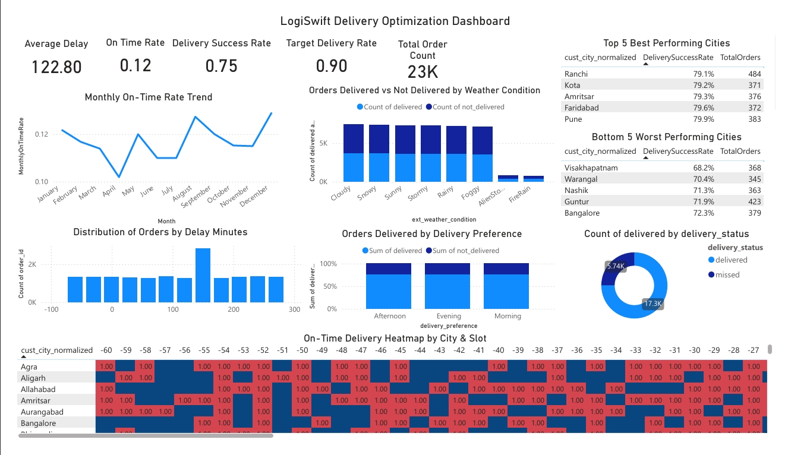

# 🚚 LogiSwift Delivery Optimization (LSDO) Project  
---

## 📌 Executive Summary  
LogiSwift, a leading last-mile delivery partner in India, faced significant challenges with delivery slot allocation.  

- ❌ 25% of deliveries missed promised 2-hour/same-day slots  
- 📉 Partner NPS dropped by 12 points  
- 💸 Revenue loss of ₹12 crore last quarter due to cancellations  
- ⚠️ Risk of ₹30 crore loss in upcoming festive season  

✅ Using **Python (EDA, Logistic Regression)** and **Power BI (Interactive Dashboard)**, this project demonstrates how predictive analytics and real-time dashboards can optimize delivery performance, improve on-time rates, and reduce costs.  

---

## 🏢 Business Problem  
LogiSwift’s outdated slot allocation system caused:  
- High delivery delays (25% missed slots)  
- Rising cancellations and revenue leakage  
- Decreasing repeat contracts (−8%)  
- Growing competition with modernized systems  

---

## 🎯 Objectives  
- Improve **on-time delivery rate** by 20%  
- Reduce **logistics cost per delivery** by 15%  
- Build a scalable predictive model for **10M+ monthly orders**  
- Deploy a **Power BI dashboard** for real-time decision making  

---

## 📂 Project Structure  
```
logiswift-delivery-optimization/
│
├── README.md
├── requirements.txt
│── LogiSwift_Delivery_Optimization_Report.pdf
|── LogiSwift_Delivery_Optimization_nb.pdf
│
├── notebooks/
│ └── Delivery_Optimization_nb.ipynb
│
├── dashboard/
│ └── LSDO_Dashboard.pbix
│
├── images/
| └── Dashboard.jpeg
```
---

## 🛠️ Methodology  

### 🔹 Data Analysis (Python - Jupyter Notebook)  
- Exploratory Data Analysis (EDA)  
- Logistic Regression (baseline model)  
- Feature engineering: transit time, traffic/weather impact, courier allocation  

### 🔹 Dashboarding (Power BI)  
- KPIs: On-time %, Cost per Delivery, Delay Trends  
- Visualizations: Trend charts, courier performance, confusion matrix  

---

## 📊 Dashboard Preview  
Here’s the interactive Power BI dashboard used in this project:  

  

---

## ✅ Results & Business Recommendations  
- Current baseline model shows **84% overall accuracy** but fails to capture late deliveries.  
- Dashboards help stakeholders **monitor courier efficiency & delays** in real time.  
- **Business should:**  
  - Upgrade to advanced ML models (XGBoost, LightGBM)  
  - Implement **address data cleaning** (25% noisy data)  
  - Improve **courier allocation system** using predictive scores  

---

## 🔮 Next Steps  
- Deploy tree-based predictive models (XGBoost/LightGBM)  
- Integrate with real-time GPS + weather APIs  
- Run **A/B testing** with improved slot allocation strategies  
- Scale dashboard for **10M+ monthly orders**  

---

## 📂 Appendix / Definitions  
- **On-time Rate** = % of orders delivered within promised window  
- **pred_miss** = Model-predicted late delivery  
- **Churn Indicator** = Whether customer stopped using service after late delivery  
- **Logistic Regression Coefficients Table** *(to be inserted)*  

---

## 🤝 Call to Action  

For questions, collaborations, or deeper walkthroughs of dashboards and notebooks:  
📩 Email: **dewansh03@gmail.com**  
🔗 [Connect with me on LinkedIn](https://www.linkedin.com/in/dewansh-vishwakarma)  

---
