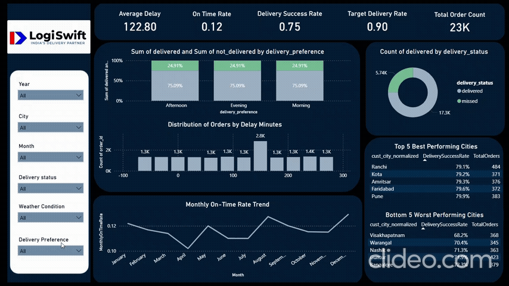

# LogiSwift Delivery Optimization (LSDO) Project  

## Executive Summary  
LogiSwift, a leading last-mile delivery partner in India, faced significant challenges with delivery slot allocation.  

-  25% of deliveries missed promised 2-hour/same-day slots  
-  Partner NPS dropped by 12 points  
-  Revenue loss in last quarter due to cancellations  
-  Risk of loss in upcoming festive season  

Using **Python (EDA, Logistic Regression)** and **Power BI (Interactive Dashboard)**, this project demonstrates how predictive analytics and real-time dashboards can optimize delivery performance, improve on-time rates, and reduce costs.  

## 🎥 Demo

> If the GIF doesn’t play, double-click on it to view the full animation.

## Business Problem  
LogiSwift’s outdated slot allocation system caused:  
- High delivery delays (25% missed slots)  
- Rising cancellations and revenue leakage  
- Decreasing repeat contracts (−8%)  
- Growing competition with modernized systems  

##  Objectives  
- Improve **on-time delivery rate** by 20%  
- Reduce **logistics cost per delivery** by 15%  
- Build a scalable predictive model for **10M+ monthly orders**  
- Deploy a **Power BI dashboard** for real-time decision making  

## Results & Business Recommendations  
- Current baseline model shows **84% overall accuracy** but fails to capture late deliveries.  
- Dashboards help stakeholders **monitor courier efficiency & delays** in real time.  
- **Business should:**  
  - Upgrade to advanced ML models (XGBoost, LightGBM)  
  - Implement **address data cleaning** (25% noisy data)  
  - Improve **courier allocation system** using predictive scores  

## 📫 Connect with Me  
  

